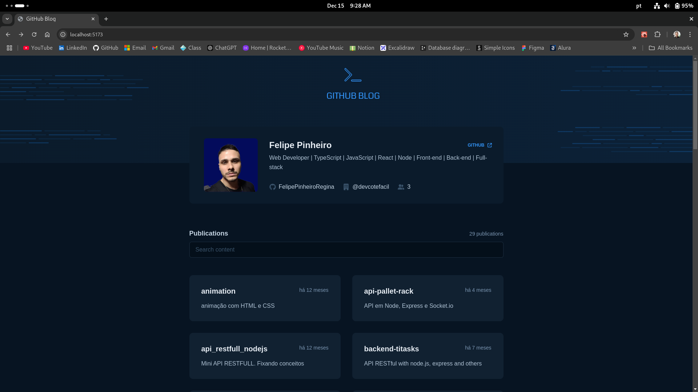
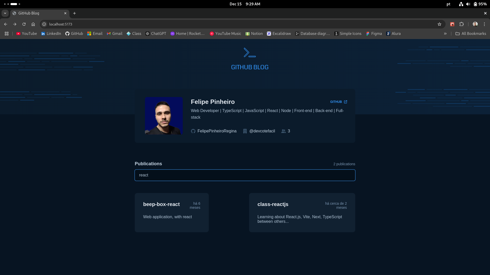
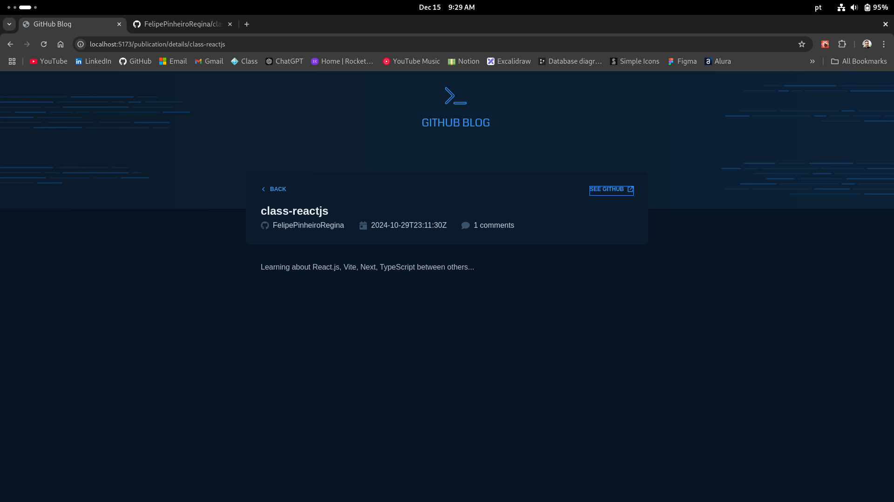

# GitHub Blog

Este projeto é um blog pessoal que consome a API pública do GitHub para exibir informações do usuário e seus repositórios como publicações. Ele foi desenvolvido com React, utilizando boas práticas de organização, componentização, contextos e estilização moderna.


<hr>


<hr>


<hr>

## ✨ Tecnologias Utilizadas

- **React 18** – Biblioteca principal para construção da interface.
- **TypeScript** – Tipagem estática para maior segurança e produtividade.
- **Vite** – Ferramenta de build e desenvolvimento rápido.
- **Styled-components** – CSS-in-JS para temas e estilos dinâmicos.
- **React Router DOM v7** – Gerenciamento de rotas SPA.
- **Axios** – Requisições HTTP.
- **date-fns** – Manipulação de datas.
- **React Icons** – Ícones SVG prontos para React.
- **ESLint** – Padronização e qualidade de código.

## 🚀 O que o projeto faz?

- Exibe um card com informações do usuário do GitHub (nome, bio, empresa, seguidores, link para o perfil).
- Lista os repositórios do usuário como "publicações".
- Permite buscar publicações pelo nome do repositório.
- Ao clicar em uma publicação, exibe detalhes do repositório selecionado.

## 📁 Estrutura do Projeto

```
github-blog/
  src/
    components/        # Componentes reutilizáveis (AuthorCard, Input, etc)
    contexts/          # Contextos React para User e Repos
    outlets/           # Layouts de página
    pages/             # Páginas principais (Home, PublicationDetails)
    routes/            # Definição das rotas
    services/          # Configuração do axios
    styles/            # Temas e estilos globais
```

## 🧩 Contextos React

O projeto utiliza Context API para gerenciar e compartilhar dados do usuário e dos repositórios globalmente, evitando prop drilling e facilitando o consumo dos dados em qualquer componente.

Exemplo de uso do contexto de usuário:
```tsx
// src/contexts/UserContext/UserContext.tsx
export function UserContextProvider({children}: PropsUserContextProvider) {
    const [ user, setUser ] = useState({} as User)
    // ...fetchUser()
    return (
        <UserProvider.Provider value={{user}}>
            {children}
        </UserProvider.Provider>
    )
}
```

Os providers são aplicados no topo da aplicação, garantindo acesso global:
```tsx
// src/main.tsx
<ThemeProvider theme={themes}>
  <GlobalStyle/>
  <UserContextProvider>
    <ReposContextProvider>
      <AppRoutes/>
    </ReposContextProvider>
  </UserContextProvider>
</ThemeProvider>
```

## 🗂️ Rotas e Navegação

O projeto utiliza React Router DOM v7 para navegação SPA:
- `/` – Página inicial com lista de publicações
- `/publication/details/:name` – Detalhes de uma publicação (repositório)

Exemplo de definição de rotas:
```tsx
// src/routes/index.tsx
<Routes>
  <Route path='/' element={<LayoutDefault/>}>
    <Route path='/' element={<Home/>}/>
    <Route path='/publication/details/:name' element={<PublicationDetails/>}/>
  </Route>
</Routes>
```

## 🎨 Estilização e Temas

A estilização é feita com styled-components, utilizando um tema centralizado e estilos globais:
```tsx
// src/styles/global.ts
export const GlobalStyle = createGlobalStyle`
  * { margin: 0; padding: 0; box-sizing: border-box; }
  body, input, button {
    font-size: 1.6rem;
    background-color: ${props => props.theme['base-background']};
    font-family: "Nunito", sans-serif;
  }
`
```

O tema pode ser facilmente expandido para suportar dark mode ou outras variações.

## 🏗️ Boas Práticas e Componentização

- **Componentes reutilizáveis**: Exemplo do Input genérico:
  ```tsx
  // src/components/Input/index.tsx
  export function Input(props: InputHTMLAttributes<HTMLInputElement>){
      return <InputContainer {...props}/>
  }
  ```
- **Separação de responsabilidades**: Serviços de API ficam em `src/services/axios.ts`.
- **Contextos bem definidos**: Cada contexto tem seu próprio arquivo e hook customizado para consumo.
- **Estilos organizados**: Cada componente tem seu próprio arquivo de estilos.
- **Uso de hooks e tipagem**: Uso extensivo de hooks do React e interfaces TypeScript para maior clareza e segurança.

## ⚡ Como rodar o projeto

1. **Clone o repositório:**
   ```bash
   git clone <url-do-repo>
   cd github-blog
   ```
2. **Instale as dependências:**
   ```bash
   npm install
   # ou
   yarn
   ```
3. **Inicie o servidor de desenvolvimento:**
   ```bash
   npm run dev
   # ou
   yarn dev
   ```
4. **Acesse:**
   Abra [http://localhost:5173](http://localhost:5173) no navegador.

## 📌 Observações
- O projeto consome a API pública do GitHub, então pode estar sujeito a limites de rate limit.
- O código é limpo, organizado e segue boas práticas de React e TypeScript.
- Sinta-se à vontade para expandir, customizar ou sugerir melhorias!

---

Feito com 💙 por Felipe Pinheiro Regina